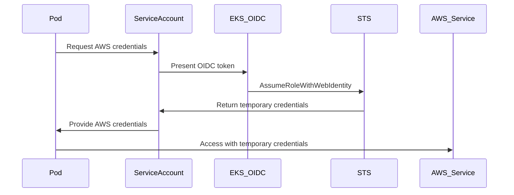
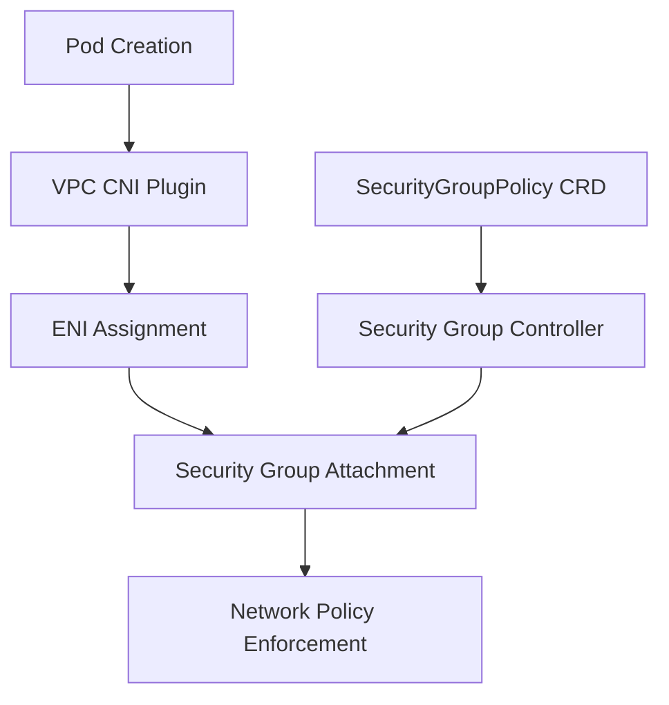
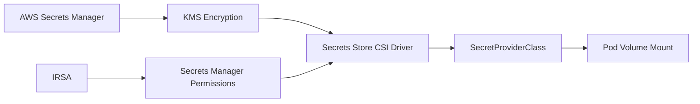

# Infrastructure and Container Security Integration Points

## Overview

This document details the critical integration points between AWS infrastructure security controls and container security implementations. These integration points ensure seamless security across the entire stack while maintaining operational efficiency and compliance requirements.

## Critical Integration Architectures

### 1. Identity and Access Integration

#### IRSA (IAM Roles for Service Accounts) Integration
The IRSA integration provides secure, temporary AWS credentials to pods without storing long-term credentials.

**Architecture Flow**:


**Integration Requirements**:
- EKS cluster OIDC provider must be enabled and configured
- IAM roles must have trust relationships with the OIDC provider
- Service accounts must be annotated with IAM role ARNs
- Pods must reference the annotated service account

**Configuration Example**:
```bash
# Enable OIDC provider for existing cluster
eksctl utils associate-iam-oidc-provider \
    --cluster secure-cluster \
    --approve

# Create IAM role with OIDC trust policy
eksctl create iamserviceaccount \
    --name s3-reader \
    --namespace production \
    --cluster secure-cluster \
    --attach-policy-arn arn:aws:iam::aws:policy/AmazonS3ReadOnlyAccess \
    --approve
```

### 2. Network Security Integration

#### VPC CNI and Security Groups for Pods
This integration allows direct assignment of EC2 security groups to individual pods, providing fine-grained network access control.

**Architecture Components**:
- **VPC CNI Plugin**: Assigns ENI interfaces to pods
- **Security Group Controller**: Manages security group assignments
- **Pod Security Group Policy**: Kubernetes CRD for security group mapping

**Integration Flow**:


**Implementation Example**:
```yaml
# Enable Security Groups for Pods
apiVersion: v1
kind: ConfigMap
metadata:
  name: amazon-vpc-cni
  namespace: kube-system
data:
  enable-pod-eni: "true"
---
# Security Group Policy
apiVersion: vpcresources.k8s.aws/v1beta1
kind: SecurityGroupPolicy
metadata:
  name: database-sg-policy
spec:
  podSelector:
    matchLabels:
      app: database
      tier: backend
  securityGroups:
    groupIds:
      - sg-database-access
```

#### Network Policy and Security Group Coordination
Kubernetes NetworkPolicies work alongside AWS Security Groups to provide layered network security.

**Coordination Strategy**:
- **Security Groups**: Coarse-grained, infrastructure-level controls
- **NetworkPolicies**: Fine-grained, application-level controls
- **Integration**: Both layers enforce complementary rules

### 3. Secrets Management Integration

#### Secrets Store CSI Driver with AWS Provider
This integration enables secure injection of AWS Secrets Manager secrets into pods as mounted volumes.

**Architecture Components**:


**Integration Configuration**:
```yaml
# Install Secrets Store CSI Driver
helm repo add secrets-store-csi-driver https://kubernetes-sigs.github.io/secrets-store-csi-driver/charts
helm install csi-secrets-store secrets-store-csi-driver/secrets-store-csi-driver \
    --namespace kube-system

# Install AWS Provider
kubectl apply -f https://raw.githubusercontent.com/aws/secrets-store-csi-driver-provider-aws/main/deployment/aws-provider-installer.yaml

# SecretProviderClass Configuration
apiVersion: secrets-store.csi.x-k8s.io/v1
kind: SecretProviderClass
metadata:
  name: app-secrets
spec:
  provider: aws
  parameters:
    objects: |
      - objectName: "prod/myapp/database"
        objectType: "secretsmanager"
        jmesPath:
          - path: "username"
            objectAlias: "db_username"
          - path: "password"
            objectAlias: "db_password"
```

### 4. Storage Security Integration

#### EBS CSI Driver with KMS Encryption
Container persistent volumes are encrypted using customer-managed KMS keys.

**Integration Points**:
- **StorageClass**: Defines encryption parameters
- **KMS Key Policy**: Controls access to encryption keys
- **IRSA Permissions**: EBS CSI driver permissions for KMS operations

**Configuration Example**:
```yaml
# Encrypted StorageClass
apiVersion: storage.k8s.io/v1
kind: StorageClass
metadata:
  name: encrypted-gp3
provisioner: ebs.csi.aws.com
parameters:
  type: gp3
  encrypted: "true"
  kmsKeyId: arn:aws:kms:us-west-2:123456789012:key/12345678-1234-1234-1234-123456789012
volumeBindingMode: WaitForFirstConsumer
allowVolumeExpansion: true
```

### 5. Monitoring and Logging Integration

#### CloudWatch Container Insights with EKS
Comprehensive monitoring integration that correlates infrastructure and container metrics.

**Integration Components**:
- **CloudWatch Agent**: Collects node and container metrics
- **Fluent Bit**: Streams container logs to CloudWatch
- **Container Insights**: Provides unified dashboards and alerts

**Deployment Configuration**:
```bash
# Deploy CloudWatch Container Insights
curl https://raw.githubusercontent.com/aws-samples/amazon-cloudwatch-container-insights/latest/k8s-deployment-manifest-templates/deployment-mode/daemonset/container-insights-monitoring/quickstart/cwagent-fluentd-quickstart.yaml | sed "s/{{cluster_name}}/secure-cluster/;s/{{region_name}}/us-west-2/" | kubectl apply -f -
```

#### GuardDuty EKS Protection Integration
Advanced threat detection that monitors both infrastructure and container runtime activities.

**Integration Features**:
- **EKS Audit Log Analysis**: Monitors Kubernetes API calls
- **Runtime Monitoring**: Detects suspicious container activities
- **Network Traffic Analysis**: Identifies malicious network patterns

**Configuration**:
```json
{
  "DetectorId": "12abc34d567e8f90g123h456i789j012",
  "Features": [
    {
      "Name": "EKS_AUDIT_LOGS",
      "Status": "ENABLED"
    },
    {
      "Name": "EKS_RUNTIME_MONITORING",
      "Status": "ENABLED",
      "AdditionalConfiguration": [
        {
          "Name": "EKS_ADDON_MANAGEMENT",
          "Status": "ENABLED"
        }
      ]
    }
  ]
}
```

## Integration Validation Framework

### 1. Identity Integration Testing
```bash
#!/bin/bash
# Test IRSA functionality
kubectl run irsa-test --image=amazon/aws-cli:latest \
    --serviceaccount=s3-reader \
    --rm -it --restart=Never \
    -- aws sts get-caller-identity

# Verify assumed role
kubectl run irsa-test --image=amazon/aws-cli:latest \
    --serviceaccount=s3-reader \
    --rm -it --restart=Never \
    -- aws s3 ls
```

### 2. Network Security Testing
```bash
#!/bin/bash
# Test Security Groups for Pods
kubectl apply -f - <<EOF
apiVersion: v1
kind: Pod
metadata:
  name: network-test
  labels:
    app: test
spec:
  serviceAccountName: default
  containers:
  - name: test
    image: busybox
    command: ['sleep', '3600']
EOF

# Verify security group assignment
kubectl describe pod network-test | grep "Security Groups"
```

### 3. Secrets Integration Testing
```bash
#!/bin/bash
# Test secrets mounting
kubectl apply -f - <<EOF
apiVersion: v1
kind: Pod
metadata:
  name: secrets-test
spec:
  serviceAccountName: secrets-reader
  containers:
  - name: app
    image: busybox
    command: ['sleep', '3600']
    volumeMounts:
    - name: secrets-store
      mountPath: "/mnt/secrets"
      readOnly: true
  volumes:
  - name: secrets-store
    csi:
      driver: secrets-store.csi.k8s.io
      readOnly: true
      volumeAttributes:
        secretProviderClass: "app-secrets"
EOF

# Verify secret mounting
kubectl exec secrets-test -- ls -la /mnt/secrets
```

## Troubleshooting Integration Issues

### Common IRSA Issues
1. **Token Exchange Failures**
   - Verify OIDC provider configuration
   - Check IAM role trust policy
   - Validate service account annotations

2. **Permission Denied Errors**
   - Review IAM policy permissions
   - Check resource-based policies
   - Verify condition statements

### Network Integration Issues
1. **Security Group Assignment Failures**
   - Verify VPC CNI configuration
   - Check ENI limits on instance types
   - Validate security group policies

2. **NetworkPolicy Conflicts**
   - Review policy precedence rules
   - Check CNI plugin compatibility
   - Validate selector labels

### Secrets Integration Issues
1. **Mount Failures**
   - Verify CSI driver installation
   - Check SecretProviderClass configuration
   - Validate IRSA permissions for Secrets Manager

2. **Secret Rotation Issues**
   - Monitor secret version updates
   - Check pod restart policies
   - Validate rotation triggers

## Security Best Practices for Integration

### 1. Principle of Least Privilege
- Grant minimal required permissions for each integration
- Use condition statements in IAM policies
- Implement resource-based access controls

### 2. Defense in Depth
- Layer multiple security controls at each integration point
- Implement both preventive and detective controls
- Use automated remediation where possible

### 3. Continuous Monitoring
- Monitor all integration points for security events
- Implement alerting for configuration drift
- Regular security assessments of integration configurations

### 4. Incident Response Integration
- Define incident response procedures for each integration point
- Implement automated isolation capabilities
- Maintain audit trails across all integrations

This comprehensive integration framework ensures that infrastructure and container security controls work together seamlessly while maintaining the highest security standards.