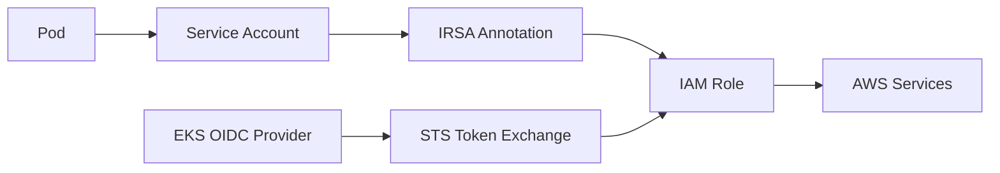
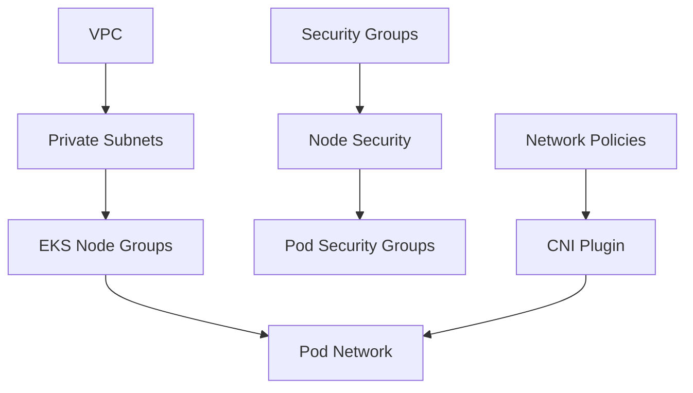
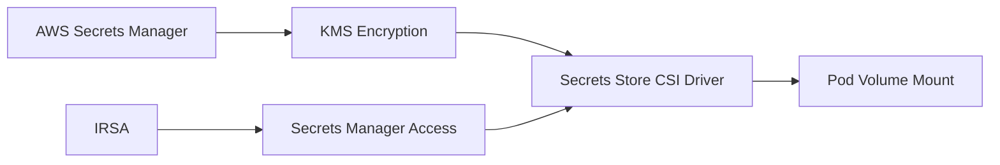
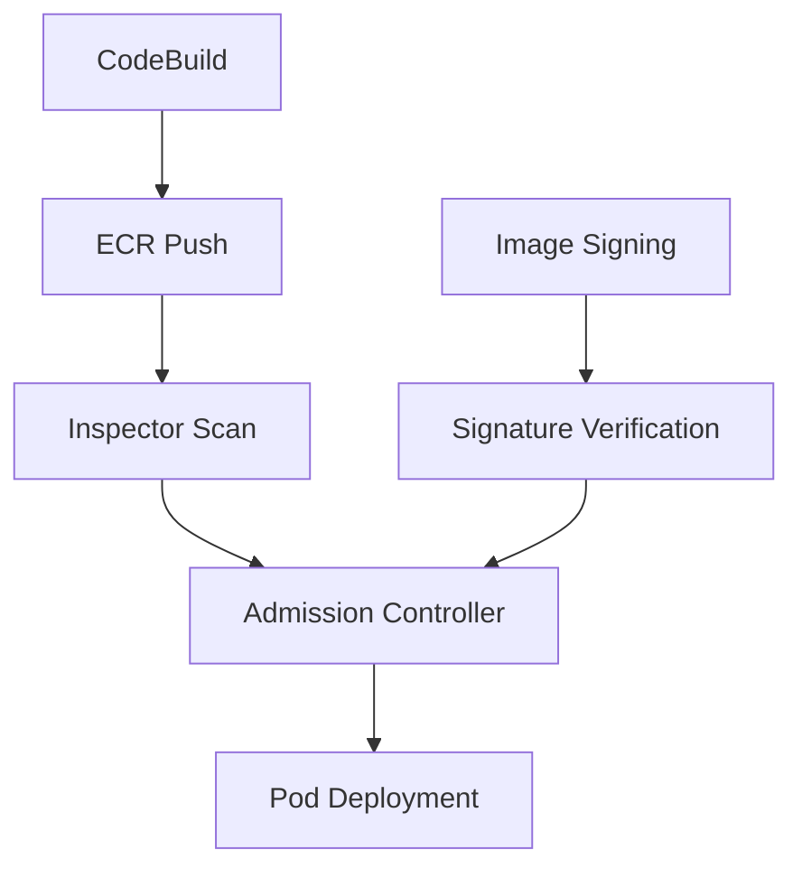

# AWS Shared Responsibility Model for Container Security

## Overview

The AWS Shared Responsibility Model defines the security responsibilities between AWS and customers when running containerized workloads. This document provides a comprehensive mapping of responsibilities across the container security stack, from infrastructure through application layers.

## Shared Responsibility Matrix

### AWS Responsibilities (Security "OF" the Cloud)

#### Physical Infrastructure
- **Data Center Security**: Physical access controls, environmental protections
- **Hardware Lifecycle**: Server provisioning, maintenance, and decommissioning
- **Network Infrastructure**: Core networking, DDoS protection, edge locations
- **Hypervisor Security**: Host OS patching, hypervisor hardening

#### Managed Service Security
- **Amazon EKS Control Plane**: API server security, etcd encryption, control plane patching
- **Amazon ECR**: Registry infrastructure, image storage encryption at rest
- **AWS Fargate**: Serverless compute isolation, kernel-level security
- **Amazon Inspector**: Vulnerability scanning service availability and accuracy

### Customer Responsibilities (Security "IN" the Cloud)

#### Container Images and Applications
- **Image Security**: Base image selection, vulnerability scanning, SBOM generation
- **Application Code**: Secure coding practices, dependency management
- **Container Configuration**: Dockerfile security, non-root users, minimal attack surface
- **Image Signing**: Digital signatures for supply chain integrity

#### Kubernetes Configuration
- **Pod Security**: SecurityContext configuration, Pod Security Admission policies
- **RBAC**: Service account permissions, role-based access controls
- **Network Policies**: Pod-to-pod communication rules, ingress/egress controls
- **Admission Controllers**: Policy enforcement, image verification

#### Infrastructure Configuration
- **EKS Node Groups**: Node AMI selection, instance types, auto-scaling configuration
- **VPC Design**: Subnet configuration, route tables, security groups
- **Encryption**: KMS key management, encryption in transit and at rest
- **Monitoring**: CloudWatch configuration, GuardDuty setup, log retention

## IaaS Controls Mapping to Container Security

### Network Security Controls

| IaaS Control | Container Security Requirement | Implementation |
|--------------|--------------------------------|----------------|
| VPC Isolation | Network segmentation between environments | Private subnets for EKS nodes, separate VPCs per environment |
| Security Groups | Pod-level network access control | Security Groups for Pods (SGP) when available |
| NACLs | Subnet-level traffic filtering | Default deny rules, explicit allow for required traffic |
| VPC Endpoints | Secure AWS service access | Private endpoints for ECR, S3, Secrets Manager |
| AWS Network Firewall | Egress traffic filtering | Domain-based filtering, threat intelligence integration |

### Identity and Access Management

| IaaS Control | Container Security Requirement | Implementation |
|--------------|--------------------------------|----------------|
| IAM Roles | Pod-level AWS permissions | IRSA (IAM Roles for Service Accounts) |
| IAM Policies | Least privilege access | Fine-grained policies per workload |
| STS Token Exchange | Temporary credentials | OIDC provider integration with EKS |
| Cross-Account Access | Multi-account security boundaries | Assume role patterns for cross-account resources |

### Data Protection Controls

| IaaS Control | Container Security Requirement | Implementation |
|--------------|--------------------------------|----------------|
| KMS Encryption | Secrets and data encryption | Customer-managed keys for envelope encryption |
| EBS Encryption | Node storage encryption | Encrypted EBS volumes for worker nodes |
| S3 Encryption | Artifact and log encryption | Server-side encryption for build artifacts |
| Secrets Manager | Runtime secrets injection | CSI driver integration for secret mounting |

### Monitoring and Compliance

| IaaS Control | Container Security Requirement | Implementation |
|--------------|--------------------------------|----------------|
| CloudTrail | API audit logging | EKS API calls, ECR access, IAM operations |
| GuardDuty | Threat detection | EKS-specific threat detection, runtime monitoring |
| Config | Configuration compliance | EKS cluster configuration drift detection |
| CloudWatch | Centralized logging | Container logs, security events, metrics |

## Integration Points Between Infrastructure and Container Security

### 1. Identity Integration

**Integration Requirements:**
- EKS cluster must have OIDC provider enabled
- IAM roles must trust the EKS OIDC provider
- Service accounts must be annotated with IAM role ARN
- Pods must use the annotated service account

### 2. Network Security Integration

**Integration Requirements:**
- VPC CNI plugin for security group assignment to pods
- Calico or Cilium for NetworkPolicy enforcement
- Private subnets with NAT Gateway for outbound access
- VPC endpoints for AWS service communication

### 3. Secrets Management Integration

**Integration Requirements:**
- Secrets Store CSI Driver installed in EKS cluster
- IRSA permissions for Secrets Manager access
- SecretProviderClass configuration for secret mapping
- Pod volume mounts for secret consumption

### 4. Image Security Integration

**Integration Requirements:**
- ECR repository policies for image access control
- Inspector integration for vulnerability scanning
- Admission controllers for policy enforcement
- Image signing and verification workflow

## Security Assumptions and Constraints

### Infrastructure Assumptions
1. **VPC Design**: Private subnets are used for all EKS worker nodes
2. **Encryption**: All data at rest is encrypted using customer-managed KMS keys
3. **Network Access**: Internet access is provided through NAT Gateway or VPC endpoints
4. **Monitoring**: CloudTrail, GuardDuty, and Config are enabled in all regions

### Container Security Assumptions
1. **Base Images**: Only approved, regularly updated base images are used
2. **Image Scanning**: All images are scanned for vulnerabilities before deployment
3. **Pod Security**: All pods run with restrictive security contexts
4. **Network Policies**: Default-deny network policies are enforced

### Operational Constraints
1. **Compliance Requirements**: SOC 2, PCI DSS, and regulatory frameworks must be maintained
2. **Change Management**: All infrastructure changes follow approved change control processes
3. **Incident Response**: Security incidents require immediate isolation and investigation
4. **Audit Requirements**: All security-relevant events must be logged and retained

## Implementation Checklist

### Infrastructure Security
- [ ] VPC configured with private subnets and appropriate routing
- [ ] Security groups configured with least privilege access
- [ ] KMS keys created with appropriate key policies
- [ ] VPC endpoints configured for AWS services
- [ ] CloudTrail enabled with log file validation

### Container Security
- [ ] EKS cluster configured with private endpoint access
- [ ] Pod Security Admission enabled in restricted mode
- [ ] IRSA configured for workload identity
- [ ] Secrets Store CSI Driver installed and configured
- [ ] Network policies implemented for pod isolation

### Monitoring and Compliance
- [ ] GuardDuty enabled for EKS threat detection
- [ ] CloudWatch log groups configured for container logs
- [ ] Config rules deployed for compliance monitoring
- [ ] Security incident response procedures documented
- [ ] Regular security assessments scheduled

This shared responsibility model ensures that both AWS and customer responsibilities are clearly defined and properly implemented across the entire container security stack.